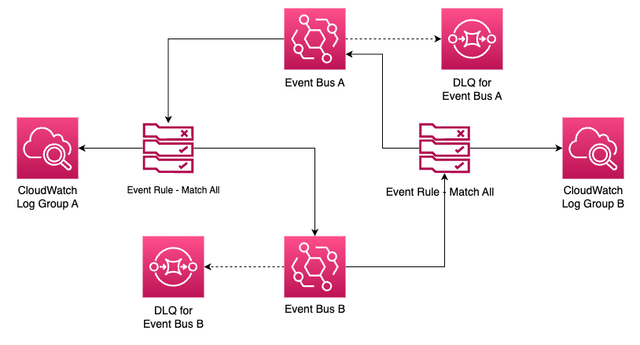

# Amazon EventBridge Bus to Bus recursive message sending

This project contains the source code of the app illustrated above.
This can be set up in your own AWS environment with AWS CDK and Python.

For explanation, please refer to this blog post:
[Blog Post URL]